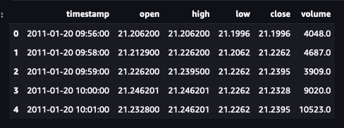

# Deep Reinforcement Learning Stock Trading Demonstration
 

### Introduction

Our objective is to demonstrate the application of Deep Reinforcement Learning (DRL) in the domain of stock trading. By leveraging advanced machine learning techniques, we aim to develop a system capable of making informed trading decisions autonomously. This involves the creation of a model that can analyze historical stock data, understand market trends, and execute trades with the goal of maximizing returns. The demonstration will cover the setup, training, and evaluation of the DRL model, showcasing its potential to outperform traditional trading strategies.

In addition to the technical implementation, we will explore the theoretical foundations of reinforcement learning and its suitability for financial markets. This includes discussing the challenges of applying DRL in a highly volatile environment, such as stock trading, and the strategies used to mitigate these risks. Our demonstration aims to provide a comprehensive overview of how deep reinforcement learning can be utilized to innovate in the field of stock trading, offering insights into both its capabilities and limitations.

### Dataset

The dataset used in this Deep Reinforcement Learning Stock Trading Demonstration comprises historical stock data, including open, high, low, close prices, and volume for a selection of stocks over a specified period. This data is essential for training our DRL model, allowing it to learn and make predictions about future stock movements based on past trends. The dataset includes a diverse range of stocks from various sectors, ensuring a comprehensive learning experience for the model. The period covered by the dataset is from [start_date] to [end_date], encompassing [number_of_stocks] stocks. We have structured the system to train and trade on a subset of the dataset that corresponds with the predefined groupings within the stock market (SP 100, DOW 30, NAS 100, etc.). This rich dataset serves as the foundation for our demonstration, enabling the DRL model to simulate trading strategies and evaluate their performance in a controlled, paper trading environment.

### Setup

The setup phase is crucial for the successful implementation of our Deep Reinforcement Learning agent. It involves the establishment of a feature store and the creation of feature groups, which are essential for organizing and managing the data our model will learn from. A feature store is a centralized repository for storing, retrieving, and managing machine learning features. Within this store, feature groups are defined to categorize and isolate different sets of features relevant to specific aspects of stock trading, such as price trends, volume changes, and market sentiment. These groups facilitate efficient data handling and model training by structuring the dataset in a way that is both accessible and meaningful for the DRL model. By meticulously setting up our feature store and carefully defining our feature groups, we lay the groundwork for a robust and scalable machine learning pipeline that is primed for the complex task of stock trading. This setup not only streamlines the model training process but also enhances the model's ability to learn from a rich and diverse dataset, ultimately contributing to more informed and effective trading decisions. In the following sections, we will delve into the specifics of how these components are integrated into our system, accompanied by illustrative diagrams and screenshots to provide a clear understanding of the setup process.

### Infrastructure Monitoring Dashboards

To ensure the smooth operation and reliability of our Deep Reinforcement Learning Stock Trading system, implementing comprehensive infrastructure monitoring dashboards is paramount. These dashboards serve as the nerve center for our system's health, providing real-time insights into various metrics and performance indicators critical to both the infrastructure and the application layers. By leveraging these dashboards, our team can proactively identify and address potential issues before they escalate, ranging from server load imbalances and memory leaks to latency spikes in data processing.

Our infrastructure monitoring setup encompasses a wide array of components, including compute resources, databases, network throughput, and application services. Each component is meticulously tracked to gauge its performance, availability, and resource utilization. For instance, compute resources are monitored for CPU and GPU usage, memory consumption, and disk I/O operations, ensuring that the trading model operates within optimal parameters. Similarly, network metrics provide insights into data transfer rates and latency, critical for timely and accurate trade execution.

The dashboards are designed with clarity and accessibility in mind, featuring intuitive interfaces that allow for easy navigation and interpretation of data. Alerts and notifications are configured to automatically inform the team of any anomalies or performance degradation, facilitating swift response and resolution. This proactive monitoring strategy not only minimizes downtime but also optimizes the system's performance, ensuring that the trading operations run smoothly and efficiently.

In the subsequent sections, we will explore the specific tools and technologies employed to build these dashboards, along with step-by-step guides on setting up alerts and interpreting the data presented. Through detailed examples and screenshots, readers will gain a comprehensive understanding of how to effectively monitor and maintain the infrastructure supporting their trading system.

### CI/CD DAG

The Continuous Integration/Continuous Deployment (CI/CD) pipeline is a crucial component of modern software development, especially in complex projects like our Deep Reinforcement Learning Stock Trading system. It automates the process of integrating code changes, testing, and deploying them to production, ensuring that the system is always running the latest, most stable version. A Directed Acyclic Graph (DAG) represents the sequence of operations or tasks in the CI/CD pipeline, illustrating the dependencies between tasks and how they are orchestrated.
Successful State

#### Successful State

In a successful state, the CI/CD DAG executes all tasks without errors, from code integration to deployment. This process begins with a developer pushing code changes to the repository, triggering the CI/CD pipeline. The pipeline then runs through several stages, such as linting, unit testing, integration testing, and deployment. Each task in the DAG is represented as a node, with edges indicating the flow and dependencies between tasks. A successful execution means that all tests pass, and the code changes are safely deployed to production, often visualized with green indicators in CI/CD tools.

#### Failed State

Conversely, a failed state in the CI/CD DAG occurs when one or more tasks in the pipeline fail. This could be due to a variety of reasons, such as syntax errors, failing tests, or deployment issues. When a failure occurs, the pipeline halts, preventing potentially unstable or broken code from being deployed. The failed task(s) are typically highlighted in red, and developers are notified to investigate and resolve the issue. The DAG visualization helps in quickly identifying the point of failure and understanding the dependencies that might be affected.

Importance of Monitoring CI/CD DAG

Monitoring the CI/CD DAG is essential for maintaining the health and efficiency of the development process. It provides real-time feedback on the state of the pipeline, enabling teams to quickly address issues and minimize downtime. Additionally, analyzing the patterns of success and failure over time can offer insights into common bottlenecks or areas for improvement in the codebase or the CI/CD process itself.

In summary, the CI/CD DAG is a powerful tool for visualizing and managing the flow of code from development to production. By closely monitoring its states, teams can ensure a smooth, efficient, and reliable development lifecycle for their Deep Reinforcement Learning Stock Trading system.